# 3D Hand Pose Benchmark

This is a benchmark for accurate 3D pose from a single RGB image.

Our dataset is extracted from the [SignWriting Hand Symbols Manual for ISWA 2010](https://www.signwriting.org/archive/docs10/sw0935_SignWriting_Hand_Symbols_ISWA2010_Sutton_Frost_2014.pdf),
and includes images of 261 different hand shapes, from 6 different angles.
All images are of the same hand, of an adult white man.


Every hand shape has images from 6 angles, consistent with different SignWriting orientations (view and plane).

- [Evaluation Metrics](#evaluation-metrics)
    * [Multi Angle Consistency Error (MACE)](#multi-angle-consistency-error-mace)
    * [Crop Consistency Error (CCE)](#crop-consistency-error-cce)
- [How to submit your system?](#how-to-submit-your-system)

Given the following 6 shape orientations:


You have a single image per orientation:


You run 3D pose estimation per image:


## Evaluation Metrics

(Additional metrics may be added in the future)

Some of the metrics here can be used as self-supervised losses.
You can optimize your 3D hand pose model on these metrics on any image of a hand, without annotating a dataset.

*These metrics do not measure the success of the pose estimation system at estimating the actual pose,
and thus should always be used in addition to other metrics.
One optimal solution with 0 error would be to predict the same tensor for all hands.


### Crop Consistency Error (CCE)

Given multiple runs of the pose estimation system at different crop sizes (with padding), 
the pose estimation result for each should be consistent.

We overlay all of the estimated hands by shifting the wrist point of each estimated hand to (0,0,0),
and calculate the average standard deviation of all pose landmarks.


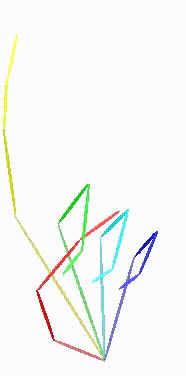

### Multi Angle Consistency Error (MACE)

We 3D rotate the hands such that the normal of the back of the hand replaces the Z axis (and the hand now lies on the XY plane):


We 2D rotate the hand such that the middle finger's metacarpal bone lies on the Y axis:


We scale the hand such that the middle finger's metacarpal bone is of constant length (200):


We overlay all of the normalized hands by shifting the wrist point of each estimated hand to (0,0,0),


And calculate the average standard deviation of all pose landmarks.


### Visualization

|      | 0 | 1 | 2 | 3 | 4 | 5 | 6 | 7 | 8 | 9 |
|------|---|---|---|---|---|---|---|---|---|---|
| CCE  | 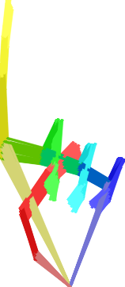  | 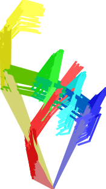 | 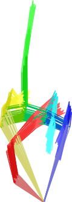 | 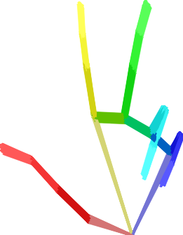 | 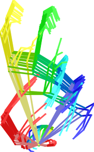 | 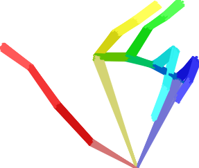 | 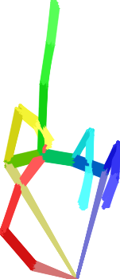 | 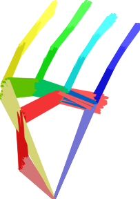 | 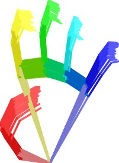 | 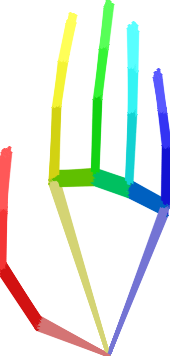 |
| MACE | 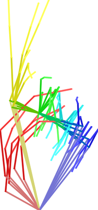 | 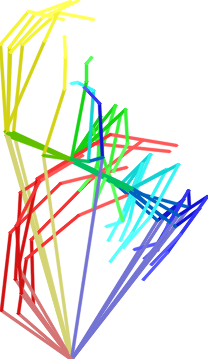 | 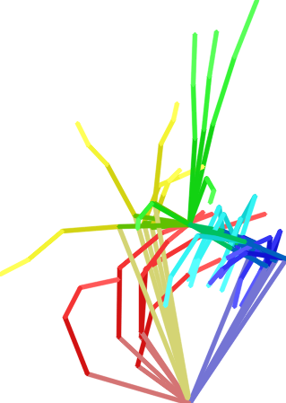 | 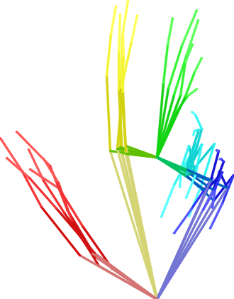 | 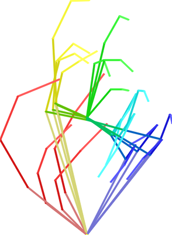 | 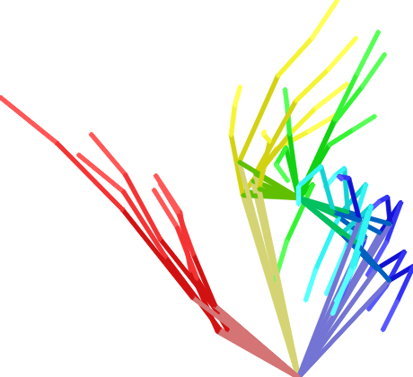 | 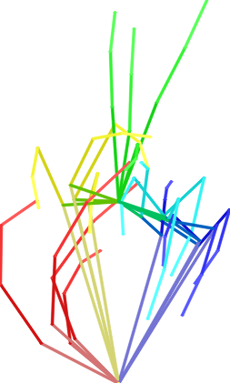 | 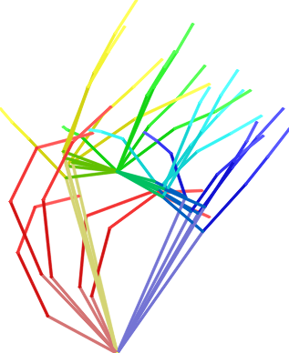 | 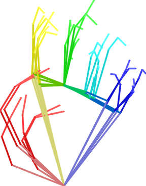 | 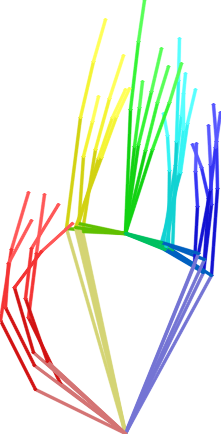 |


## How to submit your system?

For each hand shape, for each orientation, run pose estimation.
Create an array of shape:
- N number of unique crops
- 261 hand shapes
- 6 orientations
- 21 points
- 3 axis (XYZ)

Then, save your poses as a numpy file:
```python
import numpy as np

# Shape: (N, 261, 6, 21, 3)
poses = np.array(..., dtype=np.float32) 

with open('submission.npy', 'wb') as f:
    np.save(f, poses)
```

Create a directory under `benchmark/systems` with your systems's name.
In it, put as many submission files as you want. All files ending with `.npy` are considered to be submissions.

Ideally, you should also include code to reproduce your submission in your submission directory.

## Benchmark

|System Name|Runs|MACE|CCE|
|------|---|---|---|
|mediapipe/v0.8.11|48|20897±714|5089|
|mediapipe/v0.9.3.0|48|20897±714|5089|
|mediapipe/v0.10.3|48|20897±714|5089|
